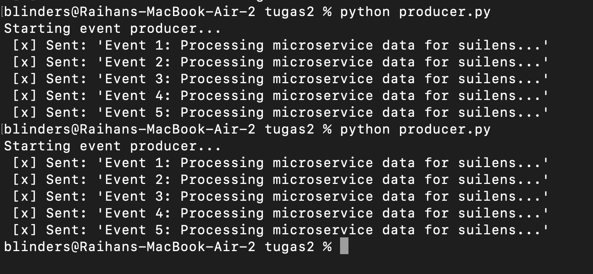
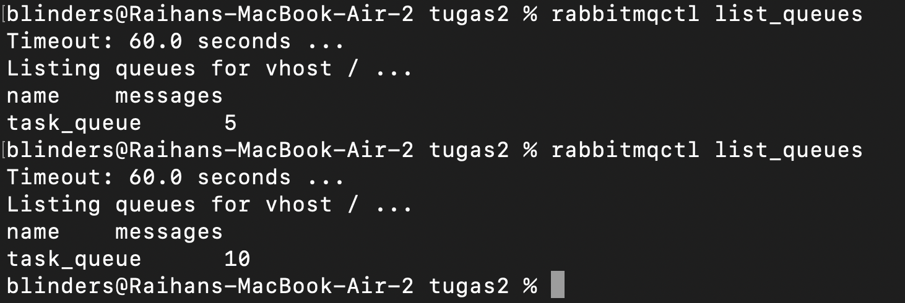
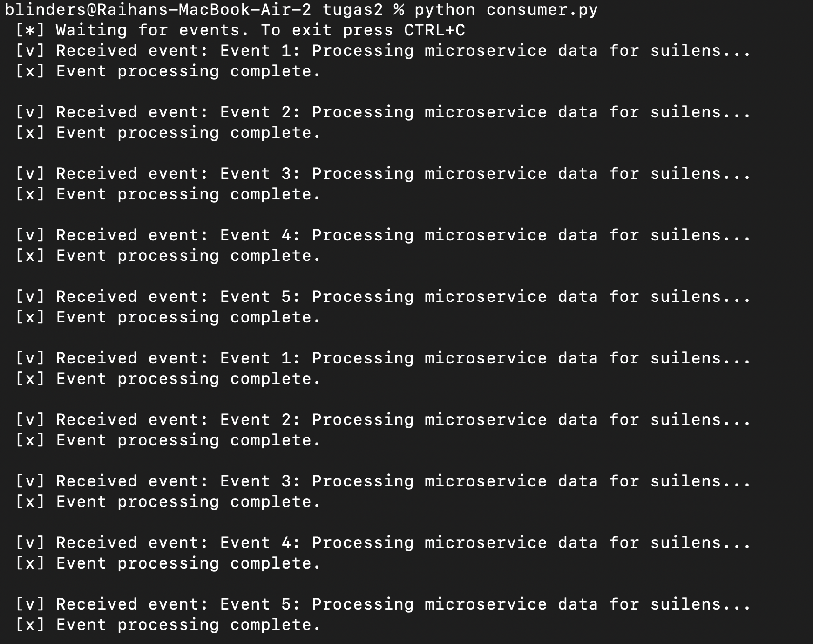
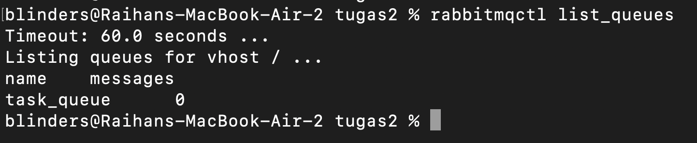

# Implementasi Event-Driven dengan RabbitMQ

## 1. Demonstrasi Pengiriman, Penyimpanan, dan Pemrosesan Event
Berdasarkan pengujian yang dilakukan, berikut adalah demonstrasi berjalannya sistem event-driven menggunakan RabbitMQ:

**A. Penyimpanan dalam Topic/Queue (Saat Consumer Mati)**
Ketika `producer.py` dijalankan sementara `consumer.py` dimatikan, pesan tidak hilang. Pesan-pesan tersebut dengan aman disimpan di dalam antrean (`task_queue`) pada message broker RabbitMQ.

Berikut penjalanan dari producer.py

dan berikut isi dari task queue yang ada

**B. Pengiriman dan Pemrosesan Real-Time**
Ketika `consumer.py` dinyalakan dan dari producer.py mulai mengirimkan event dapat terlihat bahwa secara realtime semua event diproses oleh consumer yang ada dan ketika semua event telah selesai tidak ada lagi message/event yang tersisa pada broker.

## 2. Penjelasan Mekanisme Asynchronous vs Request-Response
Dari pengujian di atas, terlihat jelas bagaimana mekanisme **Asynchronous (Event-Driven)** bekerja:
- **Mekanisme Asynchronous:** Sistem berjalan dengan prinsip fire-and-forget dan saling lepas (decoupled). Producer hanya bertugas mengirim event ke message broker tanpa peduli apakah consumer sedang aktif atau tidak, dan tidak perlu menunggu balasan (response) dari consumer untuk melanjutkan tugasnya. Jika consumer down, data tetap aman di dalam queue dan akan dilanjutkan saat sistem kembali menyala.
- **Perbedaannya dengan Request-Response Biasa (Synchronous):** Pada komunikasi request-response (misalnya REST API konvensional), klien dan server terikat erat (coupled). Klien mengirim request dan prosesnya akan terblokir (menunggu) sampai server memberikan response. Jika server mati atau prosesnya lama, komunikasi akan gagal (timeout).

## 3. Asumsi dan Keputusan Implementasi
- Message broker yang digunakan adalah **RabbitMQ** yang dijalankan secara native di localhost pada port default (5672).
- Bahasa pemrograman yang digunakan adalah Python dengan library `pika`.
- Sistem menggunakan `auto_ack=True` pada sisi consumer untuk menyederhanakan demonstrasi penerimaan pesan.

## 4. Penggunaan Generative AI
Dalam penyelesaian tugas ini, saya menggunakan **Google Gemini** untuk:
- Membantu men-generate draft kode dasar bagi producer dan consumer menggunakan library `pika`.
- Adapaun untuk kode asli, analisis serta pembuatan readme dilakukan oleh penulis.